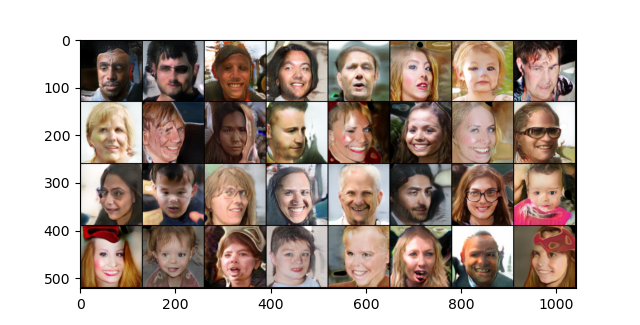
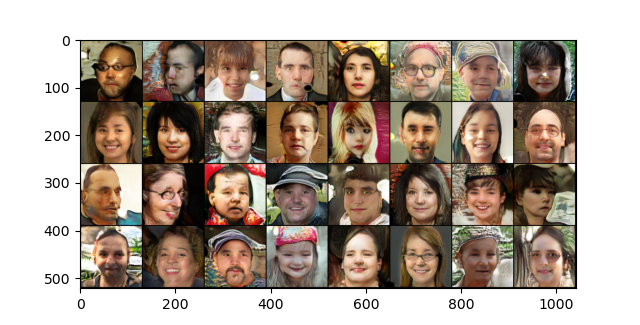

# simple-stylegan

A very simple and 99% faithful implementation of the original
[StyleGAN](https://arxiv.org/pdf/1812.04948.pdf).

Free from the convolutedness featured in all other implementations, such that
even a 5 year old can understand.

If you find any inaccuracies or implementation errors, please open an issue.

### Features
- Simple and understandable implementation
- Easy training from running a single file
- Model saving after every epoch
- Start training from pretrained / preexisting models
- TensorBoard integration to track progress
- Full control over training configuration
- Easy editing of training, optimizer, and loss configuration

## Project Structure

`data/`: Place your data in this folder

`models/`: Where model checkpoints are stored

`runs/`: Where TensorBoard reports are stored

---

`config.py`: Model and training configurations

`display.py`: Display images from your model

`ffhq_dataset.py`: FFHQ Dataset class. Can be repurposed to some other dataset.

`loops.py`: Training functions to be looped, and helper functions

`stylegan.py`: StyleGAN Model

`training.py`: Main training script

## Training Instructions

First, clone the repository:
```
git clone https://github.com/kevinMEH/simple-stylegan
```
or, if there is an existing folder:
```
git clone https://github.com/kevinMEH/simple-stylegan ./
```
Create the environment using conda/mamba:
```
mamba env create -n stylegan -f environment.yml
```
Activate the environment:
```
conda activate stylegan
```
Edit the configurations in `config.py`, then, run `training.py` to start training:
```
python training.py
```

## Dataset

By default, the [FFHQ dataset](https://www.kaggle.com/datasets/arnaud58/flickrfaceshq-dataset-ffhq)
is used to train models. To use the dataset with the project, simply place all
the images into the folder `data/ffhq/`.

NOTE: For some reason, in the Kaggle dataset which I've used and linked, images
9000 to 10999 are missing. This has been compensated for in the dataset class.

If you would like to use another dataset, you should create a new class for your
dataset and replace the FFHQ dataset with the new dataset in `training.py`.

## Default Training Configuration

By default,
- Mapping network trained using RMSprop with learning rate 0.00001
- Generator trained using RMSprop with learning rate 0.001
- Generator and mapping network trained using nonsaturing loss.
- Discriminator trained using RMSprop with learning rate 0.001
- Discriminator trained using non-saturating loss with R1 penalty factor 10.

If you would like to change these defaults, navigate to `training.py` and change
the training configurations.

## Pretrained Models

I have provided some pretrained models which you can train off of. Here are the
configurations for the pretrained models:

`stylegan_NON_SAT`:
- Model configurations:
    - z_dimensions = 384
    - w_dimensions = 384
    - image_resolution = 128
    - Generator starting_channels = 448
    - Discriminator max_channels = 448
- Training Configurations
    - batches_per_epoch = 800
    - epochs_per_double = 48
    - maximum_doubles = 3 (128 resolution)
    - alpha_recovery_epochs = 48 // 2 = 24
- Optimizer and loss configurations:
    - Mapping network trained using RMSprop with learning rate 0.00001
    - Generator trained using RMSprop with learning rate 0.001
    - Generator and mapping network trained using nonsaturing loss.
    - Discriminator trained using RMSprop with learning rate 0.001
    - Discriminator trained using non-saturating loss with R1 penalty factor 10.



`stylegan_WGAN_GP`:
- Model configurations:
    - z_dimensions = 384
    - w_dimensions = 384
    - image_resolution = 128
    - Generator starting_channels = 448
    - Discriminator max_channels = 448
- Training Configurations
    - batches_per_epoch = 800
    - epochs_per_double = 48
    - maximum_doubles = 3 (128 resolution)
    - alpha_recovery_epochs = 48 // 2 = 24
- Optimizer and loss configurations:
    - Mapping network trained using RMSprop with learning rate 0.00001
    - Generator trained using RMSprop with learning rate 0.001
    - Generator and mapping network trained using Wasserstein loss.
    - Discriminator trained using RMSprop with learning rate 0.001
    - Discriminator trained using Wasserstein loss with gradient penalty factor 10.



The images produced by my models are definitely not of the best quality. For
one, my models are very underpowered; w and z dimensions are set to 384, when
the StyleGAN paper authors used 512. Maximum image channels are set to 448, when
the StyleGAN paper authors used 512. In addition, they are trained in a
relatively short amount of time, on only 38400 images per resolution. They
produce decent results, although most of the images are far from believable.

If you want results as good as those of the paper, I recommend changing the
model parameters to match those of the StyleGAN authors (so 512 for w and z
dimensions, and for image channels in both generator and discriminator), and
at least doubling the training time of the model by changing epochs per double
to 96 or higher.

You may use my pretrained models for any non-military purposes.

## Learn More

[StyleGAN Paper](https://arxiv.org/pdf/1812.04948.pdf)

[FFHQ Dataset](https://www.kaggle.com/datasets/arnaud58/flickrfaceshq-dataset-ffhq)

[PyTorch Tutorial](https://pytorch.org/tutorials/)